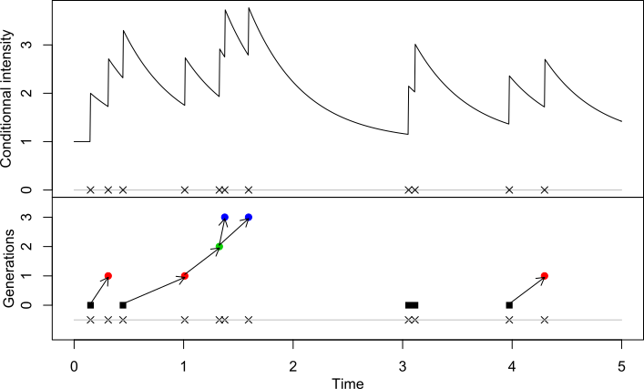

hawkesbow
================
Felix Cheysson

<!-- README.md is generated from README.Rmd. Please edit that file -->

<!-- badges: start -->

<!-- badges: end -->

This package implements a spectral approach to the parametric estimation
of Hawkes processes from Binned Observations through Whittle likelihood
(HawkesBOW). It is based on the results of the article (Cheysson and
Lang 2020).

# Installation

You can install the released version of hawkesbow from
[GitHub](https://github.com/fcheysson/hawkesbow) with:

``` r
devtools::install_github("fcheysson/hawkesbow")
```

# The Hawkes process

Hawkes processes form a family of models for point processes for which
the occurrence of an event temporarily increases the probability of
future events occurring (Hawkes 1971). Formally, a Hawkes process
 on  can
be defined from its conditional intensity
"):  where the variables
 denote the
arrival times of the process, the *immigration intensity*
 is a
positive constant, and the *reproduction function*  is a
measurable function. The reproduction function can be further decomposed
as , where  \\mathrm{d} t \< 1") is called the  and
 is
a true density function,  \\mathrm{d} t = 1"), called the .

Alternatively, the Hawkes process can be constructed as a poissonian
cluster process (Hawkes and Oakes 1974). The process consists of a flow
of *immigrants*, the cluster centres, arriving according to a
homogeneous Poisson process of intensity
. Then, an
immigrant arriving at time
 generates
*children* according to an inhomogeneous Poisson process of intensity
"). These in turn independently generate children
according to the same process, and so on *ad infinitum*. The processes
consisting of an immigrant and all its descendants are therefore
branching processes, and are independent of each other. Finally, the
process resulting from the superposition of all these branching
processes is a Hawkes process of conditional intensity
") (see the following figure of a realisation of an
exponential Hawkes process with ,  = e^{-2t}")).



This package also supports non-causal Hawkes processes, for which the
reproduction kernel

may take non-negative values on . Such processes are not defined through their
conditional intensity functions, but through the poisson cluster
representation, where each individual can potentially generate
offsprings both in the future and in the past.

The count sequence of a Hawkes process is the time series generated by
the event counts of the process, that is the series obtained by counting
the events of the process on intervals of fixed length. Formally, the
count sequence with bin size

associated to the point process
 is the sequence
_{k \\in \\mathbb Z}").

# Estimation procedure

This package fully supports the parametric estimation of Hawkes
processes from their count sequences via minimisation of the Whittle
likelihood, and partially supports the estimation from the arrival times
via maximisation of the likelihood.

#### Maximum likelihood estimation

The parameters of a Hawkes process with arrival times _{1\\le i\\le n}") on the interval ![\[0,
T\]](https://latex.codecogs.com/png.latex?%5B0%2C%20T%5D "[0, T]") can
be estimated by maximising the following pseudo-likelihood   
 = \\left( \\prod_{i=1}^n \\lambda(T_i) \\right) \\exp \\left( - \\int_0^T \\lambda(s) \\mathrm ds \\right).")  
Note that each step of the optimisation is usually of complexity
").

#### Minimisation of the Whittle likelihood

Alternatively, the parameters of a Hawkes process with count sequence
_{1\\le k\\le N}") can be estimated by minimising the log-spectral
(Whittle) likelihood   
 = \\frac{1}{4\\pi} \\int_{-\\pi}^\\pi \\left( \\log f_\\theta(\\omega) + \\frac{I_N(\\omega)}{f_\\theta(\\omega)} \\right) \\mathrm d\\omega,")  
where  = (2\\pi N)^{-1} \\left| \\sum_{k=1}^N X_k \\exp(-ik\\omega) \\right|^2")
denotes the periodogram of
") and
") its spectral density function. Note that each step
of the optimisation is of complexity ") and the periodogram can be calculated in complexity
") using a Fast Fourier Transform algorithm,
making this method usually faster than maximum likelihood estimation.

# Main usage

This package supports both Hawkes processes and their count sequences.

## Simulation of Hawkes processes

Hawkes processes can be simulated by the function `hawkes`:

``` r
hawkes(end, fun, repr, family, M=null, ...)
```

where `end` denotes the end of the interval
![\[0,T\]](https://latex.codecogs.com/png.latex?%5B0%2CT%5D "[0,T]").
This function uses the cluster representation:

  - First, the immigrants are drawn according to a (potentially
    inhomogeneous) Poisson process with intensity measure `fun`.

  - Second, the number of offsprings of an immigrant are drawn from a
    Poisson distribution with intensity `repr`.

  - Third, these offsprings are distributed according to the `family`
    distribution.

  - Then, further offsprings are generated according to the last two
    steps.

The argument `fun` can take a numeric value or be specified as a
function, in which case the argument `M` must be specified as an upper
bound on `fun` (to allow simulation of the immigration process by
thinning). The argument `family` can either be specified as a string
`name` corresponding to a distribution with random generation function
`rname` (for example `exp` for `rexp`), or directly as a random
generation function. The optional arguments `...` are passed to the
random generation function specified by `family`.

This returns a list of class `hawkes`, whose realisations are stored in
the member `p`. Other members of the list are mainly used for support
functions.

#### Examples

  - Simulate a Hawkes process with immigration intensity , reproduction mean  and reproduction kernel  = 2e^{-2t} 1_{\\{t \\ge 0\\}}") on
    ![\[0, 10\]](https://latex.codecogs.com/png.latex?%5B0%2C%2010%5D
    "[0, 10]"):

<!-- end list -->

``` r
x <- hawkes(10, fun = 1, repr = 0.5, family = "exp", rate = 2)
```

  - Simulate a Hawkes process with inhomogeneous immigration process
    with intensity  = 1 + \\sin(t)"), reproduction mean  and
    ![\[0,1\]](https://latex.codecogs.com/png.latex?%5B0%2C1%5D
    "[0,1]")-triangular reproduction kernel  = (1 - t)1_{\\{0 \\le t \\le 1\\}}"):

<!-- end list -->

``` r
x <- hawkes(10, fun=function(y) {1+sin(y)}, M=2, repr=0.25,
            family=function(n) {1 - sqrt(1 - runif(n))})
```

#### Plot function

  - Hawkes processes can be plotted with the function `plot.hawkes`:

<!-- end list -->

``` r
plot.hawkes(x, intensity = FALSE, precision = 1e3, fun = NULL, repr = NULL, family = NULL, 
            M = NULL, ...)
```

If `x` is of class `hawkes`, as for objects returned by the function
`hawkes`, arguments `fun` through `M` can be ignored. If `intensity` is
set to `FALSE`, this plots the genealogy of the simulated Hawkes process
(as in preceding figure, bottom panel). If it is set to `TRUE`, this
plots the conditional intensity of the process (as in preceding figure,
top panel).

## Estimation of Hawkes processes

Two functions implement the estimation of Hawkes processes: `mle` from
arrival times ") and `whittle` from count sequences
"). While
the optimisation procedure rely on existing functions (see below),
calculations of both the usual and Whittle likelihood functions are done
in C++ via Rcpp (Eddelbuettel and François 2011) and RcppArmadillo
(Eddelbuettel and Sanderson 2014).

#### By maximum likelihood

The maximum likelihood method is implemented by the function

``` r
mle(events, kern, end, init = NULL, opts = NULL, ...)
```

`events` holds the arrival times
") in
ascending order, `kern` must be a string (partially) matching one of the
reproduction kernels (see below) and `end` denotes the endpoint
 of observation of the
process.

The optimisation of the maximum likelihood function is done by the
function `nloptr` from the package nloptr (Johnson, n.d.) with algorithm
L-BFGS-B, where the derivatives of the likelihood are calculated
explicitly. By default, parameters are constrained to be positive, and
additionally 
is constrained to be below 1. However, both the arguments `opts` and
`...` are passed on to `nloptr`, so the algorithm, the constraints, or
any other parameter of the optimisation procedure can be changed.

Example of use:

``` r
x = hawkes(100, fun = 1, repr = .5, family = "exp", rate = 1)
mle(x$p, "Exponential", x$end)
```

#### By minimisation of the Whittle likelihood

The Whittle likelihood method is implemented by the function

``` r
whittle(counts, kern, binsize = NULL, trunc = 5L, init = NULL, ...)
```

`counts` holds the count sequence
"),
`kern` must be a string (partially) matching one of the reproduction
kernels (see below), `binsize` denotes the bin size
 and
`trunc` is the number of foldings due to aliasing taken into account.

The optimisation of the Whittle likelihood function is done by the
function `optim`, with algorithm L-BFGS-B where the derivatives of the
likelihood are approximated by finite differences. By default,
parameters are constrained to be positive, and additionally
 is
constrained to be below 1. However, the argument `...` is passed to
`optim`, so any optimisation parameter can be changed.

Example of use:

``` r
x = hawkes(1000, fun = 1, repr = .5, family = "exp", rate = 1)
y = discrete(x, binsize = 1)
whittle(y, "Exponential", 1)
```

Note that `discrete` is a useful function to create the count sequence
")
associated with an object `x` of class `hawkes`.

# Reproduction kernels

We introduce the reproduction kernels that are currently implemented in
this package. Recall that the Fourier transform of a reproduction kernel
is given by   
 = \\int_\\mathbb R \\exp(-i\\omega t) h(t) \\mathrm dt,")  
and that it is a Hermitian function  = \\overline{\\widetilde {h^\\ast}(\\omega)}").

## The exponential kernel

This is the exponential density function with parameter :   
 = \\beta e^{-\\beta t} 1_{\\{t \> 0\\}}.")  
Its Fourier transform is   
 = \\beta \\frac{1}{\\beta + i\\omega} = \\beta \\frac{\\beta - i \\omega}{\\beta^2 + \\omega^2}.")  

The exponential kernel can be specified with the string `Exponential`
and the parameter  with the usual argument `rate`. Both maximum and Whittle
likelihood methods are fully implemented for exponential kernels.
Moreover, the likelihood function is implemented in complexity
"), using the relations in (Ozaki and Ogata 1979).

## The symmetric exponential kernel

This is a symmetrised version of the exponential density function with
parameter :   
 = \\frac 1 2 \\beta e^{-\\beta |t|}.")  
Its Fourier transform is   
 = \\frac{\\beta^2}{\\beta^2 + \\omega^2}.")  

The symmetric exponential kernel can be specified with the string
`SymmetricExponential` and the parameter
 with
the argument `rate`. Only the Whittle likelihood method is implemented
for symmetric exponential kernels. Note that it is a non-causal kernel,
as  \\ne 0") for .

## The gaussian kernel

This is the gaussian density function with mean  and variance :   
 = \\frac{1}{\\sigma \\sqrt{2\\pi}}\\exp\\left(-\\frac{(t-\\nu)^2}{2\\sigma^2}\\right).")  
Its Fourier transform is   
 = \\exp\\left(-\\frac{\\sigma^2\\omega^2}{2}-i\\nu\\omega\\right).")  

The gaussian kernel can be specified with the string `Gaussian` and its
parameters 
and 
with the usual arguments `mean` and `sd` respectively. Only the Whittle
likelihood method is implemented for gaussian kernels. Note that it is a
non-causal kernel, as  \\ne 0") for .

## The power law kernel

This is a normalised and shifted power law function, with shape
 and scale :   
 = \\theta a^\\theta (t+a)^{-\\theta-1} 1_{\\{\\theta \> 0 \\}}.")  
For positive , its Fourier transform is given by   
 = \\theta \\exp(i\\omega a)E_{\\theta + 1} (i\\omega a),")  
where
") denotes the integral   
 = \\int_1^\\infty t^{-\\theta} \\exp(-ixt) \\mathrm dt.")  
With successive integration by parts, this integral can be related to
"), with .

If  or equivalently , the integral
"),
called the exponential integral with imaginary argument, can be related
the trigonometric integrals and calculated using Padé approximants (Rowe
et al. 2015, Appendix B), accurate to better than
. The function `E1_imaginary` implements this approximation.

If  or equivalently , the integral
") can be related to the incomplete gamma function with
imaginary argument   
 = \\int_x^\\infty t^{\\alpha-1} e^{-it} \\mathrm{d}t,")  
where . We implemented Taylor approximations of this
integral, accurate to better than
, in the function `inc_gamma_imag`.

The power law kernel can be specified with the string `PowerLaw` and its
parameters  and  with the
arguments `shape` and `scale` respectively. Both maximum and Whittle
likelihood methods are implemented for power law kernels.

## The Pareto kernels

This is the Pareto density function with shape  and scale :   
 = \\theta a^\\theta t^{-\\theta - 1} 1_{\\{t \> a\\}}.")  
For positive , its Fourier transform is given by   
 = \\theta E_{\\theta + 1} (i\\omega a),")  
see above for the definition of
").

Only Pareto kernels with fixed , , and
 have been implemented
and can specified with the strings `Pareto1`, `Pareto2` and `Pareto3`
respectively, with parameter  specified with the argument `scale`. Only the Whittle method is
available for Pareto kernels.

# To be implemented

  - Improve this vignette: it is currently too sparse and functions of
    the package could need some better description.

  - Add some real datasets to the package: real life case-studies with
    good datasets help understand the functionalities of a package.

  - Variance and confidence intervals for the estimation with function
    `whittle`: note that currently, the variance-covariance matrix
    returned by the optimisation method in function `whittle` is not
    accurate, as it ignores the dependence within the count sequence
    ").

  - Diagnostics for the estimated model: spectral density based
    goodness-of-fit tests are to be implemented for the estimated Hawkes
    processes, based on the work of (Paparoditis 2000).

  - Custom built-kernels: allow the user to input reproduction kernels
    that are not already implemented.

<!-- Bibliographie -->

# References

<div id="refs" class="references">

<div id="ref-Cheysson2020">

Cheysson, Felix, and Gabriel Lang. 2020. “Strong mixing condition for
Hawkes processes and application to Whittle estimation from count data.”
*arXiv*, March. <https://arxiv.org/abs/2003.04314>.

</div>

<div id="ref-Eddelbuettel2011">

Eddelbuettel, Dirk, and Romain François. 2011. “Rcpp : Seamless R and
C++ Integration.” *J. Stat. Softw.* 40 (8): 1–18.
<https://doi.org/10.18637/jss.v040.i08>.

</div>

<div id="ref-RcppArmadillo">

Eddelbuettel, Dirk, and Conrad Sanderson. 2014. “RcppArmadillo:
Accelerating R with High-Performance C++ Linear Algebra.” *Computational
Statistics and Data Analysis* 71: 1054–63.
<http://dx.doi.org/10.1016/j.csda.2013.02.005>.

</div>

<div id="ref-Hawkes1971a">

Hawkes, Alan G. 1971. “Spectra of Some Self-Exciting and Mutually
Exciting Point Processes.” *Biometrika* 58 (1): 83–90.
<https://doi.org/10.2307/2334319>.

</div>

<div id="ref-Hawkes1974">

Hawkes, Alan G., and David Oakes. 1974. “A cluster process
representation of a self-exciting process.” *J. Appl. Probab.* 11 (03):
493–503. <https://doi.org/10.2307/3212693>.

</div>

<div id="ref-Johnson">

Johnson, Steven G. n.d. “The NLopt nonlinear-optimization package.”

</div>

<div id="ref-Ozaki1979">

Ozaki, T., and Yosihiko Ogata. 1979. “Maximum likelihood estimation of
Hawkes’ self-exciting point processes.” *Ann. Inst. Stat. Math.* 31 (1):
145–55. <https://doi.org/10.1007/BF02480272>.

</div>

<div id="ref-Paparoditis2000">

Paparoditis, Efstathios. 2000. “Spectral density based goodness-of-fit
tests for time series models.” *Scand. J. Stat.* 27 (1): 143–76.
<https://doi.org/10.1111/1467-9469.00184>.

</div>

<div id="ref-Rowe2015">

Rowe, B. T. P., M. Jarvis, R. Mandelbaum, G. M. Bernstein, J. Bosch, M.
Simet, J. E. Meyers, et al. 2015. “GalSim: The modular galaxy image
simulation toolkit.” *Astron. Comput.* 10: 121–50.
<https://doi.org/10.1016/j.ascom.2015.02.002>.

</div>

</div>
